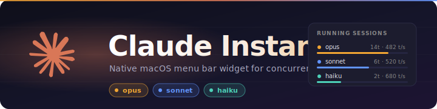
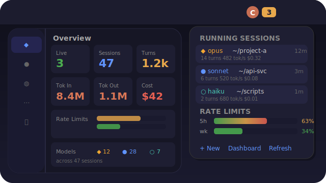

<div align="center">

  

</div>

<h1 align="center">Claude Instances</h1>

<p align="center">
  Native macOS menu bar app for monitoring and managing concurrent Claude Code sessions.
</p>

<p align="center">
  
  
  
  
  
</p>

---

<!-- ── Preview (full UI mockup) ─────────────────────────────────────────────── -->
<details>
<summary><b>UI preview</b> — menu bar dropdown + dashboard (click to expand)</summary>

<div align="center">



</div>

</details>

---

## About

A native macOS menu bar widget that gives you instant visibility into all your running
Claude Code sessions. See live instance count, token usage, rate limits, and session
history at a glance. Click any instance to focus its Ghostty terminal tab instantly.
Resume past sessions with a single click.

Built as a single Swift file compiled with `swiftc` -- no Xcode project, no external
dependencies, no package managers. Just `bash native/build.sh --install` and it runs
forever via LaunchAgent.

### Tiered Refresh

The widget uses a two-tier scan strategy for responsiveness without overhead:

| Tier | Interval | Duration | Scope |
|------|----------|----------|-------|
| **Quick scan** (`--quick`) | Every 5s | ~90ms | Live instances + rate limits |
| **Full scan** | Every 30s (6th tick) | ~185ms | + history, events, aggregates |

Quick scan results merge into the cached full scan -- live data and rate limits stay fresh
while expensive operations (filesystem walks, event parsing, aggregate computation) run
at a relaxed cadence.

## Quick Start

```bash
# Build, sign, and register as a LaunchAgent (auto-starts on login)
bash native/build.sh --install

# Or just build and run once (no auto-start)
bash native/build.sh
```

The Claude logo appears in your menu bar. Click it to see your running sessions.

## Features

### Menu Bar Icon

- Static coral Claude logo PNG -- dims to 50% when no instances are running
- Instance count badge in monospaced font (or `-` when idle)
- Count text turns orange at 75% rate limit, red at 90%
- Shows `! N` when permission requests are pending

### Dropdown Menu (min-width 340pt)

- **Rate limits** -- `[██████░░░░] 52% . 7d:12%` progress bar matching statusline.sh
  style, with 4-tier color thresholds (green <50% / yellow 50-75% / orange 75-90% / red >90%)
- **Usage stats** -- Today/Week aggregates: sessions, turns, cost, inline model badges
  (`*11 .5 o2` for Opus/Sonnet/Haiku counts)
- **Live instances** -- model badge, leaf folder + full path (wrapping), tab title,
  elapsed, ↳ subagent count (purple), ⎇ git branch (teal) + `*N` modified-files count
  (orange/red by burn level). Last user prompt shown as `❯ <prompt>` below.
  Row 2: context remaining (color-coded green/orange/red), turns, tool calls (orange),
  output tokens (green), cost (stepped gray/orange/red), RAM (stepped), tok/s (stepped).
  Compaction warning row when ctx < 15%. Focus file path wraps. MCP-down warning in red.
  Click row to open submenu: Open in Finder / Terminal (Ghostty) / VSCode, View Transcript,
  Copy PID, Terminate.
- **Recent events** -- per-type Unicode symbols with semantic color + inline model badge
- **Session history** -- last 6 sessions, clickable to resume via `claude --resume`
  in a new Ghostty tab
- **Actions** -- New Session (Cmd+N), Dashboard (Cmd+D), Refresh submenu (cadence picker:
  1/2/5/10/30/60s + Pause), Terminate All, Quit. Footer shows "Updated Ns ago · refresh: cadence"
  with paused state escalating to orange.

### Transcript View (HTML)

Click "View Transcript" on any instance's submenu to open a styled HTML view of
its conversation in your default browser. Background daemon regenerates the file
on disk every 5 minutes; click ↻ Refresh in the page toolbar to pick up fresh
content sooner.

- **Header** — AI-generated title, model · PID · session · branch · permission-mode pills
- **Stats** — input / output / cache-read / turns; CPU / MEM / MCP-up / MCP-down
- **Tools used** — horizontal-bar breakdown by tool name
- **Activity timeline** — clickable colored buttons; each jumps to its block + flashes
- **Toolbar** — search, role chips (You / Claude / Tools), ↻ Refresh, live indicator
- **Conversation** — markdown rendering via `marked.js` + `highlight.js` (CDN). Headings,
  lists, tables, blockquotes, syntax-highlighted code blocks. Auto-link bare URLs.
- **Tool calls** — grouped, expandable. Each shows tool name, copyable file paths,
  full input JSON, and (for `Edit`) red/green-tinted side-by-side OLD/NEW with
  language-specific highlighting.
- **Inline events** — `⚙ N hooks ran`, `🔓 permission mode → auto`, `↳ subagent` markers
- **Block index + datetime** — every card shows `#N` index and HH:MM:SS with full-datetime tooltip
- **Light/dark theme toggle** — persists across reloads via localStorage
- **State persistence** — search, chip toggles, scroll position survive reload via sessionStorage

### Native Dashboard (SwiftUI)

A floating `NSPanel` with `NavigationSplitView` sidebar and `.ultraThinMaterial`:

| Tab | Description |
|-----|-------------|
| **Overview** | Today/Week aggregate cards (sessions, turns, tokens, cost), model usage breakdown badges, 8 stat cards, rate limit bars, live status |
| **Live** | Instance cards with full metrics, hover-reveal action buttons, transcript viewer |
| **History** | Searchable, sortable table with tokens, cost estimates, hover-reveal resume/transcript actions, summary stats footer |
| **Events** | Timeline with deep history toggle, event type filter picker, model badges, tab title context, tool details for PostToolUse events |
| **All Sessions** | Deep filesystem scan of ALL past sessions with search, sort, resume, and transcript actions |
| **About** | App info, build metadata, keyboard shortcuts, data sources, tab guide, troubleshooting |

## Architecture

```
+-----------------------------------------------------------------+
|  DATA SOURCES                                                    |
|  scan.sh (JSON)    /tmp/claude-statusline-*    ~/.claude/projects |
|  statusline.sh --> ~/.claude/widgets/.limits.json (rate limits)   |
+--------+-----------------------+-------------------+-------------+
         | 5s/30s tiered         | metrics            | on-demand
         v                       v                    v
+-----------------------------------------------------------------+
|  CORE                                                            |
|  BarDelegate --> ScanResult Cache --> DashboardData (@Published) |
|    quick scan: merge live + limits into cached full result       |
|    full scan:  replace everything (history, events, aggregates)  |
+-----------------------------------------------------------------+
         | menuNeedsUpdate                       | SwiftUI binding
         v                                       v
+---------------------------+   +--------------------------------------+
|  NSMenu Dropdown          |   |  SwiftUI Dashboard (NSPanel)         |
|  . Rate limit bar         |   |  . Overview / Live / History         |
|  . Usage stats            |   |  . Events / All Sessions / About     |
|  . Live instances         |   |  . NavigationSplitView sidebar       |
|  . Events + History       |   |  . Hover-reveal action buttons       |
|  . Actions (Cmd+N/D/R)   |   |                                      |
+------------+--------------+   +-------------------+------------------+
             | click/action                         | button action
             v                                      v
+-----------------------------------------------------------------+
|  ACTIONS (AppleScript + Process)                                 |
|  focusGhosttyTab()  resumeSession()  terminate()  openTranscript()|
+-----------------------------------------------------------------+
             |                               |
             v                               v
       Ghostty Terminal               Finder / Chrome
```

### File Structure

```
~/.claude/widgets/claude-instances/
+-- native/
|   +-- claude-instances-bar.swift    # Single-file app (~3900 lines)
|   +-- claude-logo.svg               # Menu-bar icon
|   +-- color-sampler.swift           # Internal: vibrancy color preview tool
|   +-- build.sh                      # Compile + install + manage
|   +-- .build-info                   # Auto-generated build metadata
+-- lib/
|   +-- scan.sh                       # Python scanner --> JSON output (~950 lines)
|   +-- detail.sh                     # Transcript HTML generator (~1500 lines)
+-- plugin.sh                         # Legacy SwiftBar plugin (kept)
+-- render.sh                         # Legacy HTML dashboard renderer
+-- dashboard.html                    # Legacy HTML dashboard
+-- PLAN.md                           # Design document + implementation record
+-- UPGRADE-PLAN.md                   # Phase 1-5 upgrade plan and progress
+-- README.md                         # This file
```

### Key Components

| Component | Role |
|-----------|------|
| `BarDelegate` | `NSApplicationDelegate` + `NSMenuDelegate`. Manages status item, menu, tiered scan timers, action handlers. |
| `ScanResult` | Codable struct decoded from `scan.sh` JSON. Contains live instances, history, events, rate limits, aggregates. |
| `DashboardController` | Manages the floating `NSPanel`. Creates SwiftUI views via `NSHostingView`. |
| `DashboardData` | `ObservableObject` bridging cached scan data into SwiftUI. Handles on-demand All Sessions scan. |
| `OverviewTabView` | Today/Week aggregates, model breakdown badges, stat grid, rate limit bars. |
| `EventsTabView` | Timeline with deep history toggle, event type filter, model badges, tool details. |
| `AllSessionsTabView` | Deep filesystem scan of `~/.claude/projects/` -- search, sort, resume, view transcripts. |
| `AboutTabView` | Help/about page with build info, keyboard shortcuts, data sources, and troubleshooting. |
| `OverviewSection` | Reusable section container with icon header -- used by Overview and About tabs. |
| `focusGhosttyTab()` | AppleScript bridge -- finds and focuses the Ghostty tab matching a working directory. |
| `resumeSession()` | AppleScript -- opens a new Ghostty tab, cd's to the project, runs `claude --resume`. |

### Data Models

| Struct | Source | Key Fields |
|--------|--------|------------|
| `LiveInstance` | scan.sh | pid, model, modelFull, cwd, elapsed, turns, inputTokens, outputTokens, costUsd, toolCalls, sessionState, subagentCount, statusline |
| `SessionState` | scan.sh | state (thinking/responding/tool_use/idle), detail |
| `StatuslineMetrics` | `/tmp/claude-statusline-<pid>` | cpu, mem, rssMb, focusFile, tokSpeed, costVel, ctxRemaining, walSinceCp, mcpDown |
| `SessionHistory` | scan.sh | sessionId, project, model, turns, sizeKb, modified, tokensIn, tokensOut, costUsd |
| `FullSession` | All Sessions scan | sessionId, project, projectDirName, model, turns, sizeKb, modified, tokensIn, tokensOut, jsonlPath |
| `Event` | scan.sh | event, ts, project, sessionId, model, tabTitle, tool |
| `RateLimits` | scan.sh (via .limits.json) | fiveH (pct/used/cap), week (pct/used/cap) |
| `Aggregates` | scan.sh | today/week (sessions, turns, tokensIn, tokensOut, costUsd), modelBreakdown |

### Data Flow: Rate Limits

Rate limit percentages flow through a cross-process cache:

1. **Claude Code** pipes session status JSON (including `rate_limits.five_hour.used_percentage`)
   to `statusline.sh` on every tool use/notification
2. **statusline.sh** parses the percentages and writes them as a side-effect to
   `~/.claude/widgets/.limits.json`
3. **scan.sh** reads the cache file (in both quick and full scans) and includes it in the
   JSON output as `limits`
4. **Swift widget** decodes `RateLimits` and renders the progress bar in both NSMenu and
   SwiftUI dashboard

### Model Colors

| Model | Badge | Color | RGB |
|-------|-------|-------|-----|
| Opus | `*` | Warm amber/gold | `(0.95, 0.65, 0.20)` |
| Sonnet | `.` | Vibrant blue | `(0.38, 0.58, 1.0)` |
| Haiku | `o` | Teal/mint | `(0.30, 0.82, 0.72)` |

## Build Management

```bash
bash native/build.sh              # Compile + launch (replaces running instance)
bash native/build.sh --install    # Compile + register LaunchAgent (auto-start)
bash native/build.sh --uninstall  # Remove LaunchAgent + kill widget
bash native/build.sh --logs       # Tail the debug log
bash native/build.sh --status     # Show running instances + build info
```

### LaunchAgent

When installed via `--install`, the widget registers as a LaunchAgent
(`dev.claude-instances.menubar`) that:

- Starts automatically on login (`RunAtLoad`)
- Restarts on crash (`KeepAlive.SuccessfulExit = false`)
- Logs to `~/Library/Logs/ClaudeInstances/bar.log` (rotated at 1 MB → `bar.log.1`)
  - Format: `<ISO8601> [pid] [INFO|WARN|ERROR] <msg>`
  - Tail live: `tail -F ~/Library/Logs/ClaudeInstances/bar.log`
  - Errors only: `grep '\[ERROR\]' ~/Library/Logs/ClaudeInstances/bar.log`

### Dedupe

The app kills any existing `claude-instances-bar` processes on startup via `pgrep`/`kill`,
ensuring only one instance runs at a time even if launched manually while the LaunchAgent
is active.

## Dependencies

- **macOS 13+** (Ventura) -- for `NavigationSplitView`, `.ultraThinMaterial`
- **Swift 5.9+** -- ships with Xcode 15+
- **Ghostty** -- for tab focus via AppleScript (falls back to generic activation)
- **Python 3** -- used by `scan.sh` and `detail.sh` for JSON generation
- No external packages. No Xcode project. Single-file `swiftc` compilation.

## Troubleshooting

| Problem | Fix |
|---------|-----|
| Two icons in menu bar | Hover over the stale one (macOS clears ghost icons on hover). Or: `bash build.sh --uninstall && bash build.sh --install` |
| Icon not appearing | Check `bash build.sh --status`. If not running, `tail ~/Library/Logs/ClaudeInstances/bar.log` |
| Menu shows "Scanning..." | `scan.sh` may be failing. Test with `bash lib/scan.sh` directly |
| No rate limit bar | Requires an active Claude session for statusline.sh to write `.limits.json`. Check: `cat ~/.claude/widgets/.limits.json` |
| Dashboard won't open | Requires macOS 13+. Check logs for SwiftUI errors |
| "Focus" doesn't switch tabs | Ghostty must have Accessibility permission in System Settings |

## License

MIT
